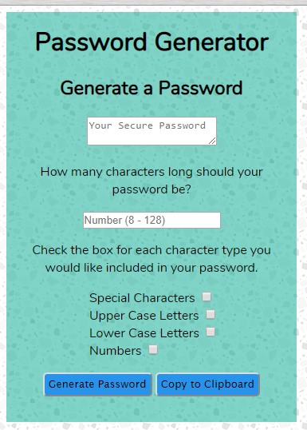

# Password Generator

## What it is

This is a password generator to create passwords of varying lengths.

## Where it is

The live deployment of this generator is located here <https://juliet2319.github.io/password-generator/>

## How to use it

Enter the length you want your password to be in the number box. Valid lengths are between 8 and 128 characters.

Beside each character type check the box if you would like to include that type of character in your password.

Character types not checked will not be included in the password.

At least one character type must be included in the password to be valid.

When you have selected your password options, click the 'Generate Password' button.

If you have entered an invalid length or forgotten to select what characters to include in the password you will be alerted to the error and no password will be generated.

After a password has been generated click the 'Copy to Clipboard' button to copy the password to your computer's clipboard.
If additional passwords are needed, you may adjust your options and generate a new password.
